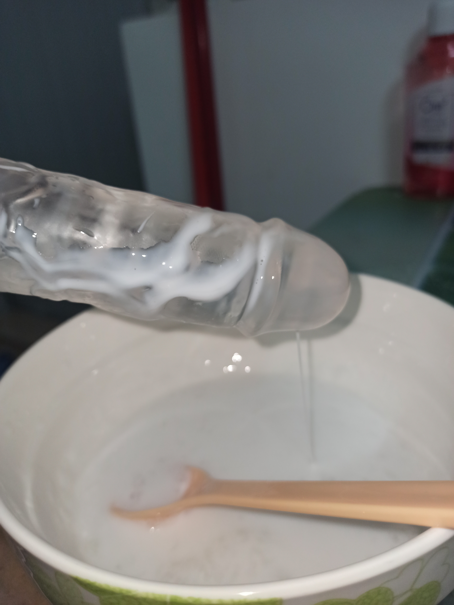
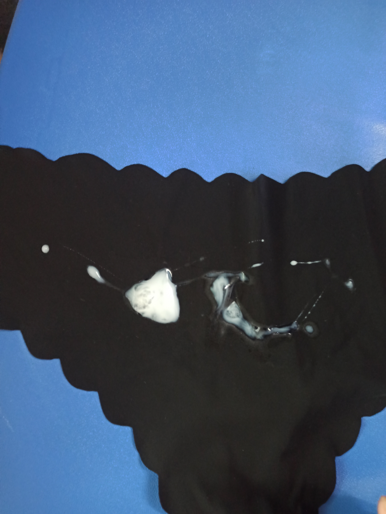
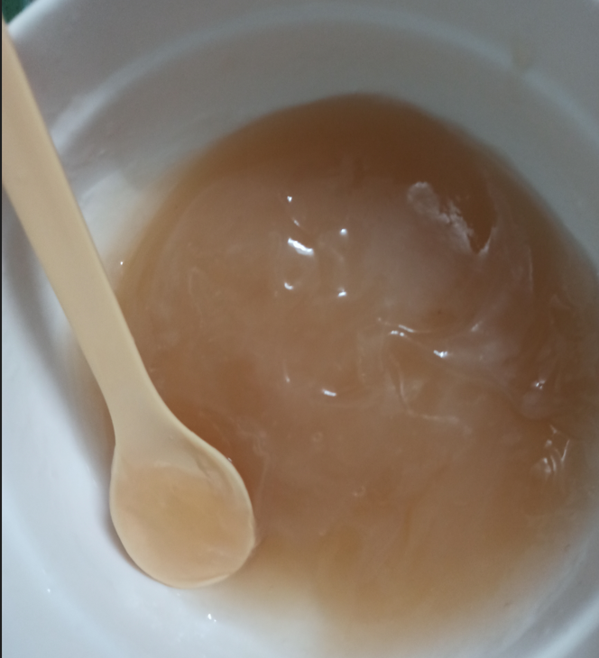
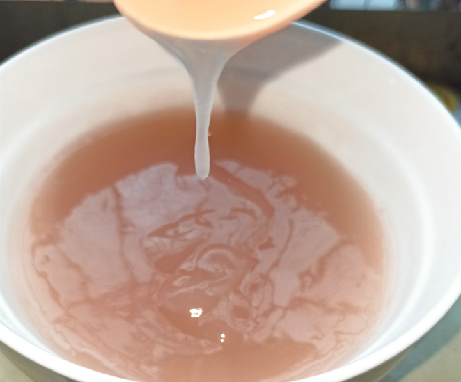
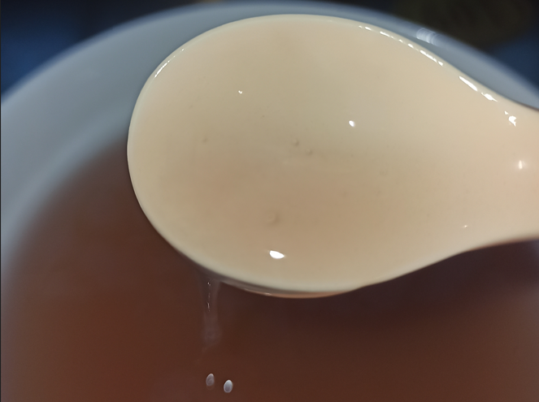

0. 前言

作为一只喜欢精液play的涩猫猫ヽ(=･ω･=)丿 不喵常常苦恼于真货产量太少还不方便储存。市面上卖的假精液呢，又基本只能拿来往身上涂抹，不太适合吃到肚子里。要么呢就是宣称能吃，但口感和气味都很奇怪，跟真货完全不像。为了能够满足自己大口吞精的涩涩梦想o(////▽////)q，于是不喵我毅然踏上了自制假精液的科研之路。

要自研假精液，当然要先分析下真精液有哪些特性嘛：首先是独特的腥臭味，其次是粘稠拉丝的触感，最后是乳白的色泽。把这三点模拟出来，我们自然就能得到色香味俱全的逼真精液啦。独特的腥臭味来自于精液里的精氨酸，所以制作假精液也需要用精氨酸作为核心原料。这一点是能够首先确定下来的。那么问题就在于剩下的两点了，稠感需要选择一种合适的食品增稠剂，颜色则需要天然或人工色素来模拟。

之前逛论坛看到一个精氨酸+杏仁露+卡拉胶的假精液配方，但我用这个配方试制了很多次，效果都不太理想。一是卡拉胶做增稠剂起效太慢，二是用来提供色泽的杏仁露太甜了，会和精氨酸抢味，导致做出来的假精液尝起来不太对。

本着对假精液科研的一片赤诚之心（其实是对涩涩完美主义的变态执着），我又买了一大堆食品添加剂。在拜见了不知道多少次成功之母，品尝了不知道多少种不同品质的假精液之后（这人没救了）。终于得到了让自己满意的制作方案(●'◡'●)，先放几张图片给大家看下效果，然后再听我细细道来哈

精液+假唧唧

精液+胖次

1. 配方介绍

食品级 L-精氨酸 执行标准：GB28306

食品级 聚丙烯酸钠 执行标准：GB29948-2013

食品级 钛白粉（二氧化钛）执行标准：GB26687-2011

注意上面三种原料一定要买食品级的，不要买成工业级的了。我把原料在国内的执行标准都列出来了，千万不要买错哦

然后咱们来分析一下三种原料的安全性，精氨酸作为20种天然氨基酸之一，本身就是一种营养补充剂。有一些研究表明适量摄入对人体有种种好处，这里我就不贴参考文献了，大家有兴趣的话自己查吧。WHO的推荐摄入剂量117mg/kg体重，安全剂量更是远远大于这个数。总之除非你拿它当饭吃，不然是不用担心对身体有害的（甚至还可能对身体有益）

而聚丙烯酸钠呢，是一种广泛使用的食品增稠剂。我查了下食品添加剂国标，规定在食品中的最大用量不超过2g/kg，也就是千分之二的用量，咱们参照这个标准来就好。话说回来，其实制作的时候手抖多放了一点也没太大关系啦，毕竟安全剂量要比这个大很多，而且咱们摄入总量也少（总不能真把假精液当饭吃吧）

至于钛白粉呢，这个还是有些争议的。二氧化钛在国内是合法的食品添加剂，按规定在饮料中的最大添加剂量为10g/L。在美国也同样允许，FDA要求最大剂量不超过食品重量的1% 。其他地方比如霓虹和澳洲也同样允许使用，唯独除了欧盟……EFSA在2021把二氧化钛踢出了安全的食品添加剂范围，理由是有研究认为它有潜在的遗传毒性。不过我个人还是倾向认为它是比较安全的，毕竟这东西在各国大量使用很多年了，再说EFSA的说法也只是有潜在的遗传毒性。与其担心假精液里的这点含量，不如担心下平时喝的奶茶、吃的包子馒头等等，这些食品都可能使用了钛白粉作为增白剂哦。当然如果你对这个实在不放心，也可以换用其他食用白色素（比如食品级碳酸钙，但它的白和钛白粉的白有些不一样就是了）。甚至更谨慎一些，不放色素也不是不行嘛。

需要采购的就是这三样东西，精氨酸使用量最大，我在淘宝买的食品级精氨酸是18块100g；食品级聚丙烯酸钠的话100g只要6.8；钛白粉用量很少，买个20g就够用了，食品级也就3-4块钱的样子。按照100mL假精液用1g精氨酸来算，30块钱足够做一大盆了。除非要玩精浴play，不然买一次原料足够玩很久啦……毕竟即使强如本喵，一次最多也就能吞个300-400mL精液啦(●ˇ∀ˇ●)总之精液play算是很省钱的性癖呢

对了，差点忘说了。买这种小袋装的食品添加剂，卖家一般会送个小量勺，那个小勺子一勺平的，差不多就是1g，大家记得留着那个小勺子，后面定量加料用得着哦

2. 制作流程

好了，扯东扯西说了好多，下面详细讲下制作的流程以及需要避坑的点：

基底。准备一碗底的饮用水（150mL左右，温水最好，冷水也行）和一把用来搅拌的小汤勺（别用送的量勺去搅哦）

调味。往水里加入1g-2g左右的精氨酸，搅拌至完全溶解就好（水里没有白色的小颗粒）。然后尝一下咸淡，啊不，是尝一下这股精味自己能不能接受。如果觉得太冲了，就兑点水，如果觉得还不够刺激，就再多加点精氨酸。每日推荐摄入量都有好几克呢，放心加不用怕。

调色。往碗里加一点点的钛白粉，那个量勺一勺是1g，而咱们只需要百分之一勺，10mg左右。所以真的只要勺底沾上一点点就够，宁可少加也不要多加。二氧化钛在水里的溶解度非常小，我们把它搅匀成悬浊液就好。

调稠度，最难也最容易失败的一关来了。往碗里慢慢的加小半勺（200mg-300mg左右）的聚丙烯酸钠，注意千万不要一坨全倒进去，要一点点撒进去，并且另一只手还要用汤勺不断搅拌。加完之后搅拌不要停，这里推荐换成打散鸡蛋的手法（别告诉我你从来不做饭，不知道怎么打鸡蛋哦）大概搅个一两分钟吧，假精液就差不多就成型了。用勺子舀一点，能看到拉丝的效果，那就是ok啦。

这一步有好几个坑，一是加入的量是宁少不多，如果稠度不够，后面可以补一点点继续搅拌调整；二是加料的手法要注意，尽量分散撒进去，不要一勺子倒在一个位置；三是搅拌手法要稳定且要用力。这三个坑随便踩一个，聚丙烯酸钠就会在碗里结成一个个的硬块，结团之后再想要把它们搅化就基本没可能了。如果踩了坑又不想浪费材料，可以想办法把这些结团的部分滤掉，然后使用剩下正常稠化的部分。不过不管怎么补救，这次制作的假精液口感都会比完美状态差很多啦。如果第四步总是失败结团，或者是对自己的手艺没什么自信。那建议做基底的时候，尽可能用偏热一点的水（开水什么的就别了哈），这样会有助于聚丙烯酸钠尽快溶解，也就没那么容易结团了。

3. 温馨提示

按照上面配方制作的假精液用于涂抹、食用或是灌入后穴都是安全的（经过本喵的理论研究外加n多次亲身验证）。但最好不要往尿道甚至膀胱里灌，有感染和机械损伤的风险。至于能不能用于阴道，这个不喵没有专门研究过（谁让咱没长这个呢→_→），不过按照一般性的知识来看，假精液没有吸收毒性和粘膜刺激性，只是由于“阴道菌群失调”这个boss的存在，假精液灌入阴道的安全性肯定是低于直肠的。当然不管怎么说跟灌入尿道比起来还是要安全太多了。

如果你之后要出门见人，最好不要玩精液play。因为玩的时候，一直闻精氨酸的气味，嗅觉会钝化。你稍微清洗一下之后可能觉得自己已经洗白白了，实际上在别人闻起来，你宛如一头全身都散发着石楠花气味的可疑怪兽。尤其是当你一开口说话，居然有股精液味的口气……我觉得光是想象一下这个社死场景就足够可怕啦……总之如果play之后不得不出门办事，还请务必好好的洗澡、漱口、更衣，可以的话再嚼片口香糖以及喷点香水吧

如果上面的可怕场景已经发生在你身上，而你又想稍微挽救下自己的社会形象。或者是你和家人朋友一起住，他们看到或是闻到你购买的精氨酸。那你可以告诉他们你最近正在服用精氨酸补充剂，然后给他们安利一下精氨酸的保健功效，最后再问他们：我弄点精氨酸给你们泡水喝一下试试？等待他们断然拒绝即可（或许也会有欣然同意的？）。这一套操作下来，大部分人应该都能被你糊弄过去（至少场面上是糊弄过去了）。另外，如果家人问你买的聚丙烯酸钠是做什么用的，你就告诉他们你正在学做麻薯。什么，你说钛白粉？呃，那就说你要做让人眼前一亮（物理）的白色麻薯……

4. 精液分享……啊呸，是经验分享

如果你从没玩过精液play，但是看了这篇指南之后春心萌动；又或是你觉得自己以往的玩法比较单调，想学习下其他人的play；再或者你根本就是想听涩涩的故事。那就请允许本喵——精液play大师（自封）来给大家分享一下吧<(￣︶￣)>

精液深喉。首先介绍的当然是不喵最喜欢的玩法啦：你需要准备一个带吸盘的假唧唧，把它吸在一面全身镜上。然后跪在镜子前，嘴里含着一大口假精液去亲吻它。不要试图用手（你也可以戴上手铐或是把手绑起来），而要用自己的嘴唇和舌尖，把精液一点点涂抹在假唧唧上。先从假唧唧顶部开始划圈，再慢慢滑向根部。等到假唧唧上挂满了乳白色的精液，再闭上你的眼睛，微微分开你的嘴唇。让假唧唧慢慢的滑进你的嘴穴，挤开你的舌头，最后深深的顶进你的喉咙。你嘴里含着的一部分精液会被假唧唧挤出来，从你的嘴角拉着丝滑落。而另一部分，则会被假唧唧强制推进你的喉咙。你会感觉到一股又腥又苦的液流灌了进来并顺流而下，反胃的感觉被咽下的精液稍稍抑制，带来一种既痛苦又满足的奇妙感受。你还可能被这次深喉呛出眼泪，别去管它，再多享受几次裹挟着精液的假唧唧在唇齿间的滑动，直到含着的那口精液全部被你吞下。这个时候睁开眼睛，你会在镜子里看见，一个泪眼迷离的自己，正舔舐着一支假唧唧，精液的余味在你的唇舌间回荡，而一线白灼则从你的嘴角滑落，滴在你的裙子或是丝袜上……如果你有一台正在录像的DV，你也许会得到一段涩涩的视频和几张涩到爆炸的照片；即使没有，你也能从镜子里欣赏到一个涩涩等级大约有五层楼那么高的自己。总之，这个play很适合用来做涩涩的前戏，它不但能湿润你的口腔和喉咙，还能湿润你的胖次和你的心哟

颜射play。如果不太喜欢被深喉的感觉，或者那天正好嗓子疼，那么颜射play也是不错的选择。你需要准备一个能用喷水的假唧唧（最好是用注射器推动的那种，用液囊吸入液体，然后捏一下蛋蛋就会喷出来的那种不太行，不好清洁还容易堵塞），然后去轻吻它，舔舐它，撸动它。等到你觉得合适的时候，推动注射器，让精液喷在你的脸上、身上或是嘴里。接着再用你的指尖，温柔的抚过自己遍布白灼的身体。再轻轻的吸吮它们，像是吮吸一支美味的冰淇淋；你也可以选择把假唧唧含在嘴里再发射，然后对着镜子展示自己涂满奶油的舌头，并把它们通通吃掉。不过发射的时候记得要屏住呼吸，不然被呛到的你可能会把精液从鼻子里喷出来，那你就会在镜子里看到一个又涩又憨的自己。又或许对你来说，涩涩而又傻傻的样子反而也不错呢？同样是作为前戏的play，如果说精液深喉是混合着痛苦与满足的烈酒；那么颜射play就是单纯而又甜蜜的奶昔吧

中出play。前戏过后就该进入肉戏了，身为男娘的你，肯定幻想过被精液填满的感觉吧。如果只是把假唧唧插进后穴喷水，感觉其实挺普通，毕竟平时灌肠的时候，差不多也是这种感觉。但如果你把假唧唧喷出的水换成加热到略高于体温的粘稠精液，你就能体会到那种和灌肠截然不同的触感。我不知道该怎样用文字去形容那种感觉，只好建议你亲身去试试。当你用手掰开自己被精液填满的后穴，看着白色的丝线顺着大腿留下，抑或是从空中的白色通道直达地面时，你就会明白不喵我所言非虚了。

5. 写在最后的碎碎念

咳咳，上面的经验分享把不喵自己都写湿了o(////▽////)q 那么这篇指南就到这里啦。如果大家对制作假精液或是精液play有什么疑问都可以在帖子里问我。另外如果有对配方、制作流程、剂量控制等技术问题有什么建议或是优化意见，也欢迎补充哦。最后如果有人喜欢听我分享精液play的话，以后我再多更一点哦（小声）。就酱（づ￣3￣）づ╭❤～

6.更新内容

2023-9-15，更新了使用精氨酸+无糖藕粉制作假精液的实验进展：帖子34楼；以及实验结论：帖子35楼。

啊，我也试过用阿拉伯胶做增稠剂。它也算是膳食纤维，比聚丙烯酸钠更健康。只可惜用在假精液里面效果不太好，被我放弃了

拉胶也勉强可以用啦。加完卡拉胶之后，你可以让它静置一段时间，等它慢慢变稠。不过因为它半天没动静，很容易怀疑自己没加够量，然后……过段时间它就会变果冻了 〒▽〒

你可以多试几次，实在不行就重新买材料吧，至少它们都很便宜啦 ╮(╯▽╰)╭

没有试过耶，藕粉里面应该也含糖吧？试过杏仁露之后我就把含糖的材料都排除掉了。

如果有那种无糖也没有别的味道的藕粉，倒是可以试一试。虽然我觉得藕粉的颜色以及粘稠度和精液还是有些差距，不过至少非常健康(๑•̀ㅂ•́)و✧

找到了原文，如下“假精液（无糖藕粉+一点点牛奶/奶精球+可以适量加些糖）加点精胺酸就有精液的味道了。精氨酸要热水化开…建议化开是佩戴口罩 不然你闻一会就习惯了 就没精液味了。”

藕粉的话我一直很喜欢吃。。难道从小就注定了我喜欢吃精液的基础（什

 大碗吃精液，大口吞唧唧ꈍ◡ꈍ

 用藕粉试做了一下，问题有点多耶 ╮(－_－)╭

咱们先说外观，首先这个就颜色不太好办，棕色里面带点粉。要调成精液那种乳白色，非常困难。

其次是粘稠度，下面这个图是按照藕粉包装上的推荐水量160mL热水冲的。对于藕粉来说很正常，对于假精液来说太稠了：

Image description

这是用了两倍的热水冲出来的粘稠度，比起精液好像还是更像黏液一些：

Image description

这是用了500mL以上的热水冲调的效果，稠度勉强像是精液了，但黏度还是太高，拉丝很容易断掉：

Image description

然后再说味道，虽然买的无糖藕粉，没有甜味来压精氨酸的味道。但是藕粉本身还是有一股独特的味道和香气，和精氨酸混在一起后多多少少还是有一些影响。再加上藕粉比我之前介绍的调制假精液粘性更大，舔食起来口感也不是很像。

最后再说这个制作便捷程度，虽然搅拌聚丙烯酸钠需要一点手法，而冲藕粉只用搅就行啦。但是冲这种速溶藕粉，要先用冷水再用开水。一套流程下来，也不见得能方便太多呢

综上所述=_=" 以我的实验情况来看，如果想做用来各种play的仿真精液，还是推荐用我那套精氨酸+聚丙烯酸钠+钛白粉的配方。用藕粉做假精液的话，各方面都要差一些。

当然啦，用藕粉也不是一无是处。如果不追求和真精液非常相似，只是想要一种有精液味道和气味的饮品的话。用藕粉还是挺不错的，能补充精氨酸，无糖低卡，还扛饿。拿来做减肥代餐也不是不行 ╮（￣▽￣）╭ 还是挺适合小毛力这样的藕粉爱好者的( •̀∀•́ )

制作流程的话，可以参考这个：

20g无糖藕粉加20mL-50mL冷水，用勺子把藕粉搅到完全溶解。

加2g-5g精氨酸（量多量少看个人口味啦），同样搅匀

加400-500mL开水（注意一定要是刚烧开的水，如果水温不够，藕粉会变成一碗稀汤的），持续搅拌到稠化。

放凉开吃（等不及的话就冷水浴降温啦）

对了，藕粉做的假精液，只适合用来品尝。不太适合用来涂抹，更不适合往下面灌哦。因为它黏性有点大，弄到皮肤上不太舒服。弄到道具上、衣物上也不是很好清洗。

聚丙烯酸钠玩过不少了，说一下我这经验，首先化开一定不要用开水或烫水，凉水最好，热水影响粘性，嫌化的慢可以配合甘油，而且甘油可以模拟那种搓起来的感觉（具体什么感觉导一发搓一下就知道了）其次拉伸性（忘了叫啥了反正是指像痰一样的一坨而不是凝胶）比较强，可以稍微配合卡波姆或羟基纤维素钠（要食品级），再就是如果要储存使用一定要加防腐剂，比如山梨酸钾，ETDA，这俩几乎没啥危害而且效果好，不加过几天就臭了发黑了，

很专业的意见呢，感谢大佬 (≥▽≤)/

我也补充说明下吧：

聚丙烯酸钠别用开水，这个我在制作流程里也有提到，用偏热一点的温水就可以。

加甘油可以增加那种拉丝感，不过甘油本身有点甜味，跟精氨酸混在一起尝起来有点怪怪的。另外食品级丙三醇用于食物是符合GB2760标准的，不过注意控制下剂量，在饮料中的添加量不要大于1%，加多了有可能会拉肚子。

羟基纤维素钠在饮料中一般是做稳定剂，起到提高固体悬浮物稳定性，防止饮料中蛋白质凝聚而发生沉淀、分层的吧？大佬这里加羟基纤维素钠是为了什么效果鸭？

防腐剂方面的问题我确实没考虑过，假精液这种东西我建议还是现做现用比较安全。如果是大量自制润滑油的话，可能会更需要防腐剂一些。

稍微看了一下 钛白粉 确实只有少量危害 不过在拆封时候 或者准备用勺挖出来的时候 如果一个喷嚏下去 吸入到身体内部 是不会被吸收的 一直停留在肺里 这个是最危险的 毕竟食品生产线护具很多 就怕意外 然后碳酸钙的话 风险也有 暂时实在不知道有什么好的色素了 emmm 然后上午试着用哪个杏仁露 做了一下 确实 卡拉胶时间太久了 完全不知道什么时候好 一直液体状态 用勺子尝了一下 被腥的恶心 这是第二次了 第一次是用玉米淀粉 就是很早的 一张图 告诉怎么做的 哪个效果更差 我记得原料是 玉米淀粉 鸡蛋清 酸奶油 还有盐 其他的忘了 也是特别的腥 而且玉米淀粉后来成块了 快和疙瘩汤一样了 看看后续有没有什么替代的安全色素 或者就像最后说的 暂时不用了

担心吸入风险的话，制作期间可以戴个口罩哦(＾▽＾)

食品级碳酸钙算是很安全的增白剂了，欧盟禁用钛白粉之后，一些糖果生产商就开始换用碳酸钙了。

固体食品的话用大米淀粉、玉米淀粉这种确实不错，但是用在饮品（比如假精液）里面就不太合适了，会变得很黏，类似之前用藕粉制作的效果呢

 发苦的话应该是精氨酸放太多了哦

你先按照150mL水，1g精氨酸这个初始比例来放。还觉得苦就再多掺点水，如果觉得太淡了就补一点精氨酸。慢慢调整直到找到你自己比较适合的量就可以啦

甘油用量要少的，一般不会超过质量0.8%，不然会特别黏跟糖浆一样，而且甜，拉丝个人感觉粗丝不加也可以拉，羟甲基纤维素钠主要是增稠剂，典型纤维增稠，好多润滑剂都用，和聚丙烯酸钠有点像，卡波姆食品级不好找，这玩意加了优点是不会跟大粘痰或者果冻一样的一坨，更倾向凝胶，和聚丙烯酸钠也类似

emmm……国庆这几天有个偶然的发现，饭前玩吞精play可以有效抑制食欲。甚至只是用浓一点的精氨酸泡水喝也有一定的效果。大概是留在嘴里的精液味导致的 (*´･д･)? 不知道对其他人是不是也有这个效果呢

正在节食的小伙伴们或许可以尝试一下◝(⑅•ᴗ•⑅)◜